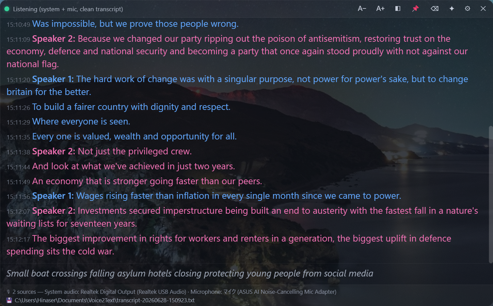

# Voice2Text

A **100% local** Windows 11 app that gives you live captions and a saved
transcript for online meetings (Zoom, Google Meet, …) — built for non-native
English speakers who want accurate, low-latency captions without sending any
audio to the cloud.

It captures **both** the meeting audio coming out of your speakers **and** your
own microphone, shows live captions in a floating overlay, saves a clean
transcript, and can summarize the meeting — all on-device.



> **Privacy:** no audio, transcript, or summary ever leaves your machine. There
> is no telemetry and no network calls at runtime (models are downloaded once,
> up front).

## Features

- **Live captions** via a streaming Zipformer ASR (Google-Live-Transcribe-style
  low-latency partials), running in real time on the CPU.
- **Dual capture** — system loopback (attendees) + your microphone ("You"),
  with software **echo suppression** so the speakers' audio leaking into your
  mic isn't transcribed twice.
- **Speaker labels** (diarization) for the remote side.
- **Clean saved transcript** — an optional Whisper large-v3 pass (GPU) rewrites
  each utterance accurately while live captions stay fast.
- **Floating overlay** — frameless, transparent, always-on-top, resizable; font
  / opacity / pin controls; global show/hide hotkey.
- **Export** the session to `.txt` / `.md` / `.srt`, or copy it.
- **Meeting summary** — a local LLM (Qwen2.5-3B on GPU) produces a summary +
  action items on demand.
- Fully **configurable** (settings panel + `config.json`).

## Architecture

A small **CPU-only** Tauri launcher drives two optional **GPU sidecar
processes**, so the base app stays light and has no hard CUDA dependency:

```
┌────────────────────────────────────────────────┐
│ Voice2Text.exe  (Tauri 2, CPU-only)             │
│  • WASAPI capture (loopback + mic)              │
│  • sherpa-onnx streaming ASR + punctuation      │
│  • speaker diarization, echo dedup              │
│  • overlay UI (HTML/CSS/JS)                      │
└──────────┬───────────────────────┬──────────────┘
           │ pipe (audio→text)     │ pipe (transcript→summary)
   ┌───────▼─────────┐     ┌───────▼──────────┐
   │ whisper-sidecar │     │ llama-sidecar    │
   │ Whisper (CUDA)  │     │ Qwen2.5 (CUDA)   │
   └─────────────────┘     └──────────────────┘
```

Crates: `app/src-tauri` (app), `app/whisper-sidecar`, `app/llama-sidecar`. The
`app/ui` folder is the web frontend. Earlier validation harnesses
(`m05-whisper-cuda`, `m1-capture`, `m35-sherpa`, `live-stt`, `live-stream`) are
kept for reference. See [`DESIGN.md`](DESIGN.md) for the full design history.

## Download

Prebuilt portable bundles are on the [**Releases**](https://github.com/Hinaser/Voice2Text/releases)
page — no build toolchain required:

- **Full (GPU)** — live captions + the clean Whisper transcript + the local-LLM
  summary. Needs an NVIDIA GPU (the CUDA runtime DLLs are bundled).
- **Slim (CPU-only)** — live captions + a streaming-quality saved transcript, no
  GPU needed.

Unzip, then run `Voice2Text.exe`. The bundles ship **binaries only**; on first
run, download the model weights once with the included script:

```powershell
powershell -ExecutionPolicy Bypass -File scripts\Fetch-Models.ps1   # add -CpuOnly for the slim build
```

(Weights aren't bundled to keep the download small and because some model
licenses don't permit redistribution — see
[THIRD-PARTY-MODELS.md](THIRD-PARTY-MODELS.md).)

## Requirements

- **Windows 11** (WebView2 is preinstalled).
- For the GPU features (clean transcript, summary): an **NVIDIA GPU** + the
  **CUDA Toolkit 12.x**. Live captions work CPU-only without a GPU.
- Build toolchain: **Rust** (stable, MSVC), **Node.js**, **Visual Studio 2022+**
  (C++ tools), **LLVM/Clang** (libclang for bindgen), **CMake**, **Ninja**.

## Quick start

```powershell
# 1. Install the JS dev dependency (Tauri CLI)
cd app; npm install; cd ..

# 2. Download the models (~3.5 GB; use -CpuOnly for just live captions)
.\scripts\Fetch-Models.ps1

# 3. Build (the helper sets up the VS + CUDA + libclang environment)
.\scripts\Build-Cuda.ps1 -CrateDir ..\app\src-tauri
.\scripts\Build-Cuda.ps1 -CrateDir ..\app\whisper-sidecar   # GPU clean transcript
.\scripts\Build-Cuda.ps1 -CrateDir ..\app\llama-sidecar     # GPU summary

# 4. Run (all workspace crates build into the shared app\target\release)
.\app\target\release\voice2text.exe
```

## Packaging

```powershell
# Self-contained portable folder (full GPU build, ~4.4 GB) under dist\Voice2Text\
.\scripts\Stage-Portable.ps1

# CPU-only slim build (~650 MB), optionally zipped
.\scripts\Stage-Portable.ps1 -Slim -Zip
```

`Stage-Portable.ps1` bundles the exe, the runtime DLLs, the CUDA runtime DLLs
(for the GPU build), and the models into a folder that runs on a clean Windows 11
machine with only an NVIDIA driver. Add `-NoModels` to ship binaries + the fetch
script instead of the weights (the form used for Releases). (A one-click NSIS
installer is wired in `scripts/Build-Installer.ps1` but currently blocked by a
Tauri bundler issue — see the comment in that script.)

### Publishing a release

`Publish-Release.ps1` builds, stages a binaries-only zip, **creates and pushes a
git tag**, and uploads the assets to a GitHub Release via the `gh` CLI. The full
(GPU) bundle is always built; `-IncludeSlim` *also* attaches the CPU-only one.

```powershell
.\scripts\Publish-Release.ps1 -Tag v0.1.0                 # GPU bundle only
.\scripts\Publish-Release.ps1 -Tag v0.1.0 -IncludeSlim    # GPU bundle + CPU-only bundle
.\scripts\Publish-Release.ps1 -Tag v0.1.0 -Draft          # stage as a draft to review first
```

## Configuration

Settings persist to `%APPDATA%\com.voice2text.overlay\config.json` and are
editable from the in-app ⚙ panel: transcript saving + folder, punctuation,
speaker labels, microphone capture, echo suppression, the system-audio and
microphone **source devices**, the Whisper clean transcript, the **summary
model** (any `.gguf` in the models folder), the show/hide hotkey, models folder,
and appearance.

The summary uses whichever GGUF chat model you pick — drop another llama.cpp
GGUF (e.g. an Apache-2.0 Llama/Mistral instruct model) into `models\` and choose
it from the dropdown. The sidecar uses the model's own chat template, so no code
change is needed.

## Licensing

- **Code:** [MIT](LICENSE).
- **Models:** downloaded separately, each under its own license — see
  [THIRD-PARTY-MODELS.md](THIRD-PARTY-MODELS.md). Note that **Qwen2.5-3B**
  (the summarizer) is under the **Qwen Research License** (non-commercial); swap
  in an Apache-2.0 model if that matters for your use.

## Status

Built and verified on the developer's machine (RTX 5080 / CUDA 12.8). Real
multi-party meeting validation (overlapping speech, device hot-swap) is the main
remaining test. Contributions and issues welcome.
